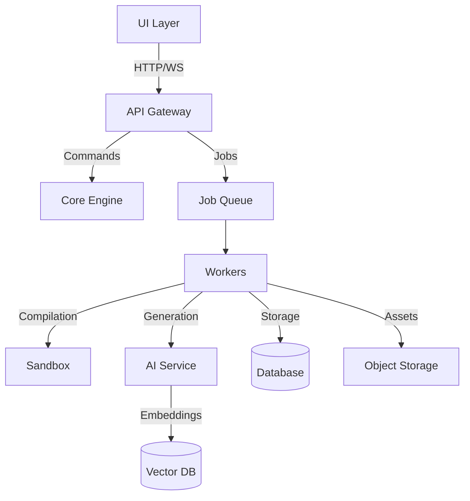

# YUGA Architecture

## Core Game Engine Architecture

### 1. Core Systems
The engine is built around these primary systems:

#### Rendering System
- GPU-accelerated graphics pipeline
- Shader management
- Material system
- Post-processing effects
- Particle systems (✓ Implemented)

#### Physics System
- Collision detection
- Force simulation
- Rigid body dynamics
- Physics debugging

#### Audio System
- 3D spatial audio
- Effect processing
- Music streaming
- Audio resource management

#### Input System
- Device abstraction
- Input mapping
- Multi-device support
- Event system

#### Scripting System
- Virtual machine
- Hot reloading
- Debugging support
- API exposure

#### Entity Component System (ECS)
- Component management
- System scheduling
- Resource sharing
- World state management

### 2. Engine Loop
```rust
fn main_loop() {
    initialize();
    load_resources();

    loop {
        process_input();    // Handle user input
        update_state();     // Update game logic
        physics_step();     // Fixed timestep physics
        update_audio();     // Process audio
        render_frame();     // Render graphics
        
        if should_exit() { break; }
    }

    shutdown();
}
```

### 3. Current Implementation Status

✅ Complete:
- Particle System with GPU acceleration
- Basic ECS framework
- Resource management
- Event system

🚧 In Progress:
- Animation system
- UI framework
- Debug tools
- Profiling system

⏳ Planned:
- AI systems
- Procedural generation
- Network replication
- Advanced physics

## Service Architecture Overview


## Module Boundaries

### 1. UI Layer (Web/Native)
- **Responsibility**: User interaction and visualization
- **Dependencies**: API Gateway only
- **Key Interfaces**:
  - `/api/projects`
  - `/api/generate`
  - `/api/compile`

### 2. API Gateway
- **Responsibility**: Request routing and auth
- **Dependencies**: Core Engine, Job Queue
- **Key Interfaces**:
  - `ProjectService`
  - `GenerationService`
  - `CompilationService`

### 3. Core Engine
- **Responsibility**: Game logic and ECS
- **Dependencies**: None (pure computation)
- **Key Interfaces**:
  - `World`
  - `Entity`
  - `Component`
  - `System`

### 4. Worker System
- **Responsibility**: Async job processing
- **Dependencies**: AI Service, Sandbox, Storage
- **Key Interfaces**:
  - `JobProcessor`
  - `AIClient`
  - `SandboxRunner`

### 5. AI Service
- **Responsibility**: Code/asset generation
- **Dependencies**: Vector DB
- **Key Interfaces**:
  - `ModelProvider`
  - `PromptTemplate`
  - `Embeddings`

## Data Flow
1. UI submits generation request
2. API validates and queues job
3. Worker processes with AI service
4. Results stored in DB/Storage
5. UI notified via WebSocket

## Key Design Decisions
1. Thin UI layer - minimal business logic
2. Worker-based async processing
3. Provider abstraction for AI models
4. Sandboxed compilation
5. Versioned storage for assets/code