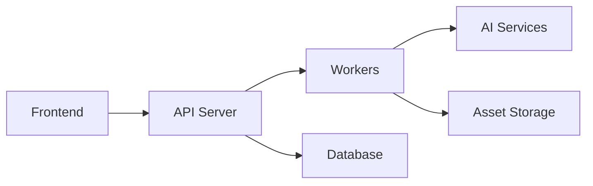

# Development Guide

This guide explains how to set up and work with the YUGA codebase.

## Table of Contents

1. [Local Development Setup](#local-development-setup)
2. [Architecture Overview](#architecture-overview)
3. [Development Workflow](#development-workflow)
4. [Testing](#testing)
5. [Debugging](#debugging)
6. [AI Integration](#ai-integration)

## Local Development Setup

### Prerequisites

- Node.js 20+
- Rust 1.75+
- Docker & Docker Compose
- Unity 2023.2+ (optional)
- Visual Studio Code

### Environment Setup

1. Clone the repository:
```bash
git clone https://github.com/Pratham-Arun/YUGA.git
cd YUGA
```

2. Install dependencies:
```bash
# Frontend & Backend
npm install

# Native Engine (if using)
cd src-native && cargo build
```

3. Set up environment:
```bash
cp .env.example .env
# Edit .env with your settings
```

4. Start services:
```bash
# Development mode
npm run dev

# Or with Docker
docker compose -f docker/docker-compose.yml up
```

### Environment Variables

```bash
# API Keys
OPENAI_API_KEY=sk-...
SUPABASE_URL=https://...
SUPABASE_KEY=eyJ...

# Services
REDIS_URL=redis://localhost:6379
DATABASE_URL=postgresql://...

# Monitoring
SENTRY_DSN=https://...
```

## Architecture Overview

### Key Components

1. Frontend (React + Three.js)
   - Web-based editor interface
   - 3D visualization
   - Code editor integration

2. Backend (Node.js + Express)
   - REST API
   - AI orchestration
   - Asset management

3. Workers
   - Background job processing
   - AI model inference
   - Asset generation

4. Native Engine (Rust + Bevy)
   - High-performance game engine
   - Native platform support
   - Advanced rendering

### Data Flow



## Development Workflow

### Branch Strategy

- main: Production-ready code
- develop: Integration branch
- feature/*: New features
- fix/*: Bug fixes

### Code Style

- TypeScript/JavaScript: Airbnb style
- Rust: rustfmt defaults
- Unity: Microsoft style

### Making Changes

1. Create feature branch
2. Make changes
3. Add tests
4. Update documentation
5. Submit PR

## Testing

### Running Tests

```bash
# All tests
npm test

# Specific components
npm run test:frontend
npm run test:backend
npm run test:e2e

# Native engine
cd src-native && cargo test
```

### Test Structure

```typescript
describe('Feature', () => {
  beforeEach(() => {
    // Setup
  });

  it('should work correctly', () => {
    // Test
  });
});
```

## Debugging

### Frontend

1. Use React DevTools
2. Chrome DevTools
3. Debug configurations in .vscode/launch.json

### Backend

1. VS Code debugger
2. Debug endpoint: /debug/info
3. Logging via monitoring service

### Native Engine

1. VS Code Rust Analyzer
2. Debug builds
3. Logging and tracing

## AI Integration

### Available Models

- OpenAI (GPT-4)
- Anthropic (Claude)
- Local (via Ollama)

### Prompt Templates

Located in `prompts/` directory:
- Code generation
- Art generation
- World generation

### Testing AI Features

1. Use mock responses in tests
2. Record real responses for e2e tests
3. Monitor token usage

## Common Tasks

### Adding a New Feature

1. Design documentation
2. Implementation plan
3. Tests
4. Documentation update
5. PR review

### Updating Dependencies

1. Check for breaking changes
2. Update lockfiles
3. Run tests
4. Update documentation

### Debugging Production

1. Check logs in Grafana
2. Review error tracking
3. Check metrics
4. Review recent changes

## Additional Resources

- [API Documentation](../api/README.md)
- [Architecture Details](../architecture/README.md)
- [Contributing Guide](../../CONTRIBUTING.md)
- [Security Guide](../security/README.md)